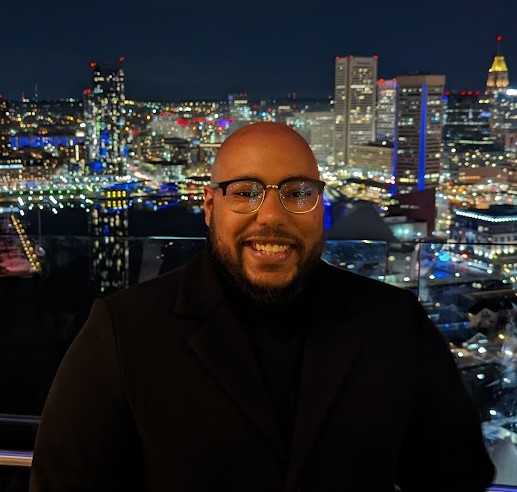

## About Me

Hi! I am currently a Network Analyst/Instructor for NetSage in the Hanover, MD area. I recently separated from the Navy after serving for 9 long years. 6 of which I gained invaluable experience with CNE methodologies spanning across the NSA and USCYBERCOM. The other three, I spent forward deployed in Yokosuka, Japan onboard the USS George Washington (CVN 73). In my free time, I enjoy traveling, playing video games and drinking a beer over discord with my friends. I made this site to network, answer questions for all servicemembers that are transitioning out of the military and maybe even to game with some of you. If you need me, please see my socials.

---

